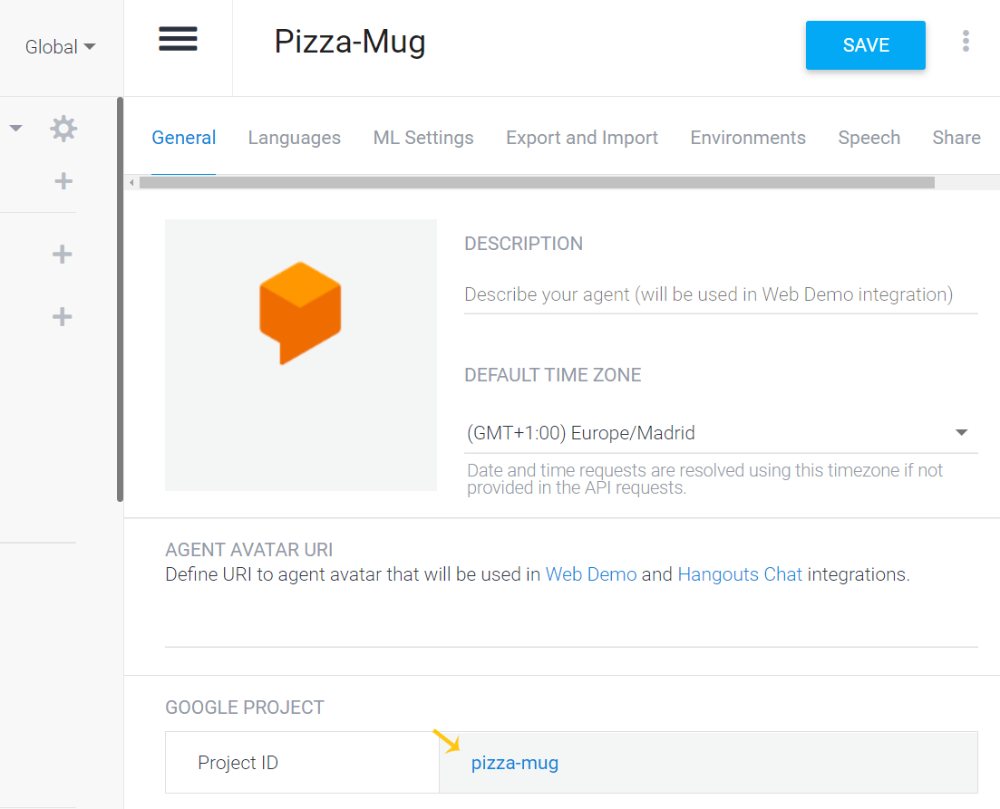
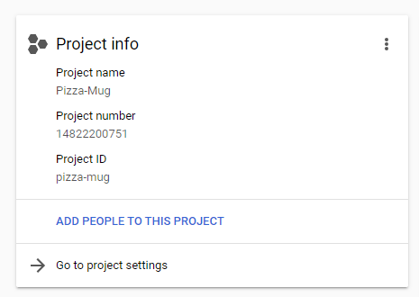
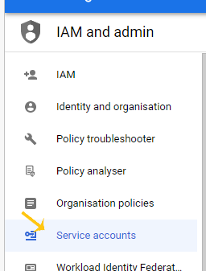
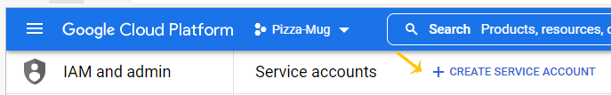
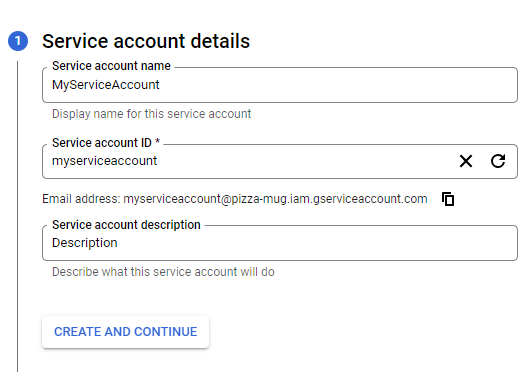
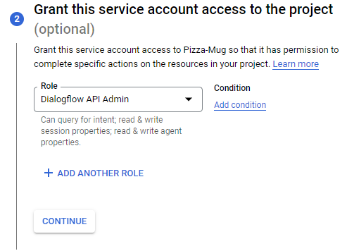
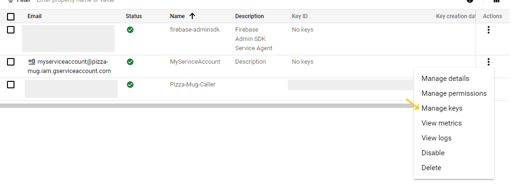

# DamienVdk.DialogFlowNetTools
Tools to call an agent in DialogFlow Essential, or to create a Fullfilment

## DamienVdk.DialogFlowNetTools.FulfillmentIntent
This nuget package allows you to quickly create a webhook for your DialogFlow agent

```powershell
Install-Package DamienVdk.DialogFlowNetTools.FulfillmentIntent
```

### Configuration

The configuration is done in the `program.cs` file. The first step is to add the necessary dependencies. This is easily done through an extension method, which adds the methode `AddDialogFlowFulfillment` to the `IServiceCollection` interface.

```csharp
var builder = WebApplication.CreateBuilder(args);

// Add services to the container.

builder.Services.AddControllers();
// Add services ...
builder.Services.AddDialogFlowFulfillment();
```

The second step is to map an endpoint that will be used by DialogFlow. As with `AddDialogFlowFulfillment`, a extension method `UseDialogFlowFulfillment`  is available in the package.

```csharp
var app = builder.Build();

app.UseDialogFlowFulfillment("/DialogFlow");
```

### Usage

When you create an intent in DialogFlow, you can respond to it via a fulfillment (webhook). In order to respect the Single Responsabilty Principle (SRP), the goal is to create a class by intent. 

In order not to have to write a long code composed of several if/else to detect which class called according to the intent, the package can automatically find the class to call and formulate the answer based on the name of the intent.

To create a class that will create the response of an intent, it is necessary to create a class with an attribute `Intent` which takes as a parameter a regex expression to know to which intent the class must respond. This class must also implement the `IIntentHandler` interface which has a method `GetResponseAsync`.

This class must have a constructor with a parameter of type `IServiceProvider`. From the latter, you can recover all the dependencies that your class needs.

```csharp
[Intent("^Hello$")]
public class HelloIntentHandler : IIntentHandler
{
    public HelloIntentHandler(IServiceProvider serviceProvider)
    {
        //_superDependency = serviceProvider.GetServices<ISuperDependency>()
    }
    
    public Task<WebhookResponse> GetResponseAsync(WebhookRequest request)
    {
        return Task.FromResult(new WebhookResponse() { FulfillmentText = "Hello response!" });
    }
}
```

## DamienVdk.DialogFlowNetTools.Integration
This package allows you to easily integrate your DialogFlow agent into your .Net application.

```powershell
Install-Package DamienVdk.DialogFlowNetTools.FulfilIntegrationlmentIntent
```

### Configuration

The configuration is done in the `program.cs` file. The only step is to add the necessary dependencies. This is easily done through an extension method, which adds the methode `AddDialogFlowIntegration` to the `IServiceCollection` interface. This method takes an `Action<DialogFlowIntegrationOption>` parameter that allows you to configure the following options. 

| Parameter name | Required | Description |
| --- | --- | --- |
| ProjectId | ✔️ | Project ID in DialogFlow |
| GoogleKeyFilePath | ✔️ | Path to key file for authentication |
| DefaultLanguage | | Language used by the agent to understand the text (Default: en-US) |

### How to find the ProjectId?

Log in to the [DialogFlow console](https://dialogflow.cloud.google.com/) and select your agent. Then, click on the settings button.


You will arrive on a page where you can get your ProjectId.



### How to get the GoogleKey file?

This file must be downloaded from the [Google Cloud Platform](https://console.cloud.google.com/).
On this site, you can search for your project based on the ProjectId. Then click on **Go to project settings**.



Choose the menu **Service accounts**



Then click on **Create a service account**.



The first step is to enter your service account name, id, and description.



Select the role DialogFlow API admin.



And finally click on Done.
On the new page, click on the **Actions** button corresponding to the service account you just created, and choose the **Manage keys** menu



You can now click on the **add key** button, and select the json format to download your GoogleKey file.

### Update your program.cs

Now that you have your ProjectId and GoogleKey file, you can add your dependency with the `AddDialogFlowIntegration` method, as shown in the code snippet below.

```csharp
services.AddDialogFlowIntegration(options =>
{
    options.GoogleKeyFilePath = "pizza-mug.json";
    options.ProjectId = "pizza-mug";
    options.DefaultLanguage = "fr-FR";
});
```

### Usage

When you need to detect an intent and get a response in a class, you need to inject the `IDialogFlowIntentDetecter` service into your constructor.

```csharp
public class MySuperClass
{
    private readonly IDialogFlowIntentDetecter _dialogFlowIntentDetecter;

    public MySuperClass(IDialogFlowIntentDetecter dialogFlowIntentDetecter)
    {
        _dialogFlowIntentDetecter = dialogFlowIntentDetecter;
    }
}
```

A conversation has a session name that remains the same throughout that conversation. It allows, for example, to manage contexts. I advise you to create a session name via the `Guid.NewGuid().ToString()`. You are free to follow this advice. This session number must be called to call the `DetectIntentAsync` method, which retrieves the intent name and the bot's response.

```csharp
var session = Guid.NewGuid().ToString();
// Some super code
var text = Console.ReadLine();
var response =  await dialogFlowIntentDetecter.DetectIntentAsync(session, text/*, you can override language here*/);
Console.WriteLine($"Intent : {response?.Intent?.DisplayName}");
Console.WriteLine($"Message : {response?.FulfillmentText}");
```

## Conclusion

You have all the keys in hand to create your super bot. Do not hesitate to create issues in case of bugs encountered, but also to give suggestions for improvements for these two nuget packages.